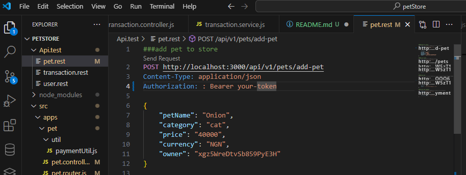

PET STORE

# DESCRIPTION
Pet store, is an api endpoint that handles request such as adding of pet for sales, displaying all available, and admin can see both available and sold pet. User can also purchase their pet of choice and make payment instantly.

# Project Features;
- complete pet and user CRUD (create, read, update, and delete).
- Data validation using Joi for both pet and user.
- user authentication and authorization.
- paystack integration as means of payment gateway.

# Technology Use
The project is build on node(expressjs)

# Storage Use
- firestore (google cloud database)

# Libraries
Libraries used can be found in package.json file witin the project file, antd it built on;
- node 18.18.x
- npm 9.8.1

# Setup and Running of The App Locally
- in your VsCode terminal run
 $ git clone [link to the project repo. on github]
- open the clone repository folder created on your machine in Vscode
- Then run the following command in Vscode terminal, or git bash
>> npm install
- to start the server
>> npm run start
- to start the server in watch mode
>> npm run dev

# Api Test
For quick testing of the api route (endpoint);
- step 1: first install 'REST Client' extention in your VsCode.
- step 2: check for the "Api.test" folder in the root of the project, which contain file for each app endpoint test.
- step 3: click open any of the file.
- step 4: to test the endpoint click on the send request

# Tech Stack
- Server: Nodejs (Express), and firestore (google cloud database).

# Project Structure
    Api.test
    src
       |_apps
            |_ pet
                  |_Util
            |_ transactionHistory
            |_ user
       |_config
       |_handler
       |_middlewares
       |_utils